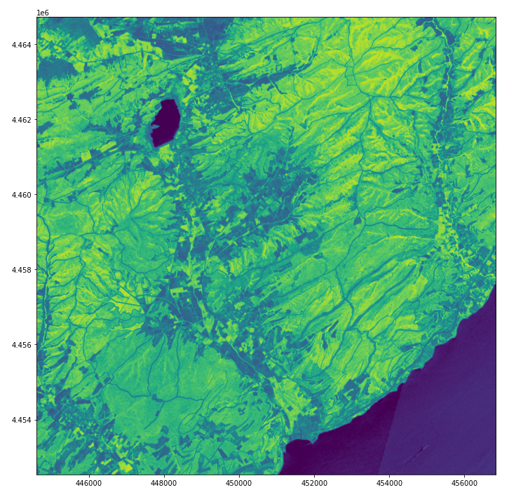
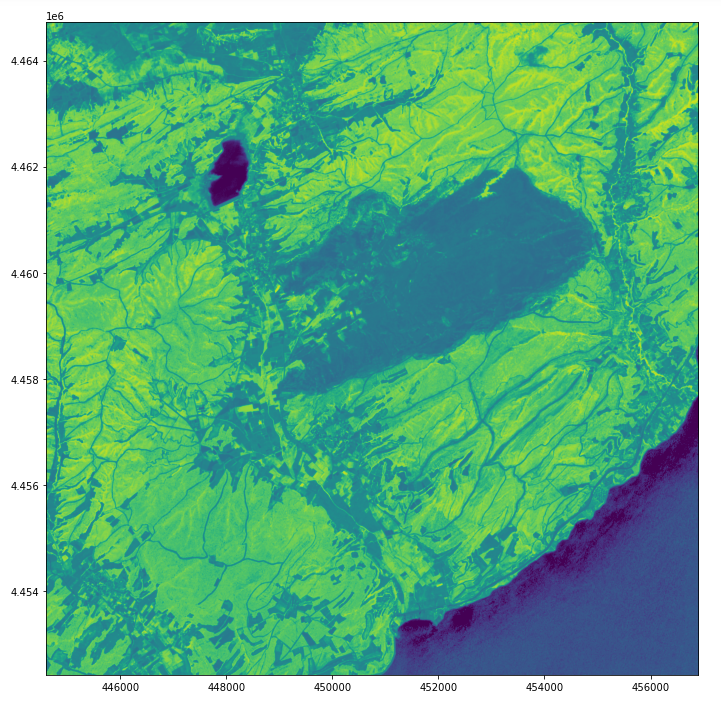

# Special Topic in Remote Sensing

## *Analysis of Burned Area with Remote Sensing : Çanakkale Forest Fire 2020*

Recently, increasing wildfires cause serious damage to trees, vegetation and many living creatures. Research on large wildfires draw attention to the damage in that area after the fire. The forest fire analysis on this topic provides great important information about forest fire riding ecological cycling and the decision-making process for post-fire treatment. Collecting data from the field after forest fires can be very difficult or even impossible. Remote Sensing and the algorithms are used to analyze the post-fire terrain, to make comparisons and various analyzes between before and after wildfire. Remote sensing is important in cost saving and time. Different satellites of various types (Sentinel, Landsat, MODIS, SPOT, etc.) are datasets used to map fire severity, fire damage and burned areas. In this study, the wildfire occurred in Gallipoli district of Çanakkale province on 6 July 2020 has been analyzed by using Sentinel-2 MSI satellite image with Remote Sensing techniques. Before and after forest fire images were used belongs to study area. 

``` Python
#!/usr/bin/env python
# coding: utf-8

# In[1]:


import rasterio
from rasterio import plot
import matplotlib.pyplot as plt
import numpy as np
get_ipython().run_line_magic('matplotlib', 'inline')


# In[6]:


import os
os.listdir()


# In[8]:


#import bands as separate 1 band raster
band4 = rasterio.open('yanginsonrasi_red.tif') #red
band8 = rasterio.open('yanginsonrasi_nir.tif') #nir


# In[15]:


#number of raster rows
band4.height
#number of raster columns
band4.width
#plot band 
plot.show(band4)
#type of raster byte
band4.dtypes[0]
#raster sytem of reference
band4.crs
#raster transform parameters
band4.transform
#raster values as matrix array
band4.read(1)
#multiple band representation
fig, (ax1, ax2) = plt.subplots(1, 2, figsize=(12, 6))
plot.show(band4, ax=ax1, cmap='Blues') #red
plot.show(band8, ax=ax2, cmap='Blues') #nir
fig.tight_layout()
#generate nir and red objects as arrays in float64 format
red = band4.read(1).astype('float64')
nir = band8.read(1).astype('float64')

nir
#ndvi calculation, empty cells or nodata cells are reported as 0
ndvi=np.where(
    (nir+red)==0., 
    0, 
    (nir-red)/(nir+red))
ndvi[:5,:5]
#export ndvi image
ndviImage = rasterio.open('C:/Users/PC/mehves/ndviImage.tiff','w',driver='Gtiff',
                          width=band4.width, 
                          height = band4.height, 
                          count=1, crs=band4.crs, 
                          transform=band4.transform, 
                          dtype='float64')
ndviImage.write(ndvi,1)
ndviImage.close()
#plot ndvi
ndvi = rasterio.open('C:/Users/PC/mehves/ndviImage.tiff')
fig = plt.figure(figsize=(18,12))
plot.show(ndvi)


# In[12]:


#import bands as separate 1 band raster
bandonce4 = rasterio.open('Yangınöncesi_ReD.tif') #red
bandonce8 = rasterio.open('Yangınöncesi_NIR.tif') #nir


# In[17]:


#number of raster rows
bandonce4.height
#number of raster columns
bandonce4.width
#plot band 
plot.show(bandonce4)
#type of raster byte
bandonce4.dtypes[0]
#raster sytem of reference
bandonce4.crs
#raster transform parameters
bandonce4.transform
#raster values as matrix array
bandonce4.read(1)
#multiple band representation
fig, (ax1, ax2) = plt.subplots(1, 2, figsize=(12, 6))
plot.show(bandonce4, ax=ax1, cmap='Blues') #red
plot.show(bandonce8, ax=ax2, cmap='Blues') #nir
fig.tight_layout()
#generate nir and red objects as arrays in float64 format
red = bandonce4.read(1).astype('float64')
nir = bandonce8.read(1).astype('float64')

nir
#ndvi calculation, empty cells or nodata cells are reported as 0
ndvi=np.where(
    (nir+red)==0., 
    0, 
    (nir-red)/(nir+red))
ndvi[:5,:5]
#export ndvi image
ndvionceImage = rasterio.open('C:/Users/PC/mehves/ndvionceImage.tiff','w',driver='Gtiff',
                          width=bandonce4.width, 
                          height = bandonce4.height, 
                          count=1, crs=bandonce4.crs, 
                          transform=bandonce4.transform, 
                          dtype='float64')
ndvionceImage.write(ndvi,1)
ndvionceImage.close()
#plot ndvi
ndvionce = rasterio.open('C:/Users/PC/mehves/ndvionceImage.tiff')
fig = plt.figure(figsize=(18,12))
plot.show(ndvionce)


# In[ ]:
```
                                                                                  BEFORE FIRE NDVI 


                                                                                   AFTER FIRE NDVI

